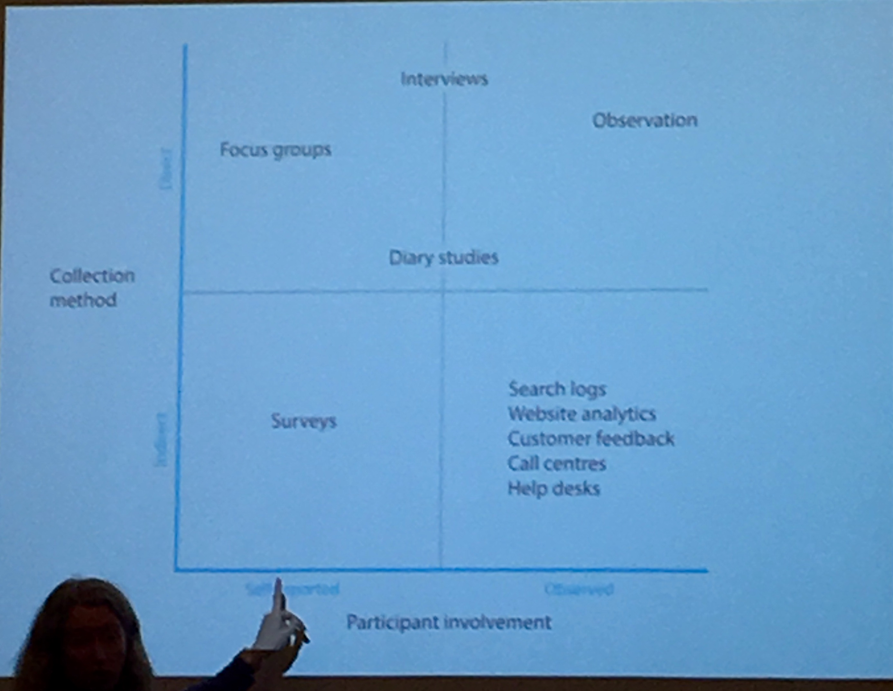

=================================
Information Architecture workshop
=================================
**25 August, 2016**
**https://uxaustralia.com.au**

Information Architecture is organising content or objects, describing them, and
providing ways for people to access it.

Project types
~~~~~~~~~~~~~
- Websites - content models, taxonomies (a list of things and how they talk to
  each other), categories, and navigation
- Web apps - Content models, task flows, navigation
- Mobile apps - Content model, task flows, categories, navigation
- Document/resource management - taxonomies

Who does it? Anyone who can look at information both from a broad and detailed
perspective, cares about language, description, and what the user .

Categories
~~~~~~~~~~

Activity
--------
Individually write 5 foods on sticky notes.
Group together and sort by categories.

Classic category theory
-----------------------
- Categories are based on shared properties.
- Categories with boundaries - things are in or out - western thinking - understanding how   
  we think we think.
- Aristotle period philosopher had ideas of how things work and embedded in
  western thought.
- All categories are of equal importance.

Modern category theory
----------------------
- Categories are embodies - we are a physical being in a body
- Category = concept = thought
- Categories are based on our personal experiences 
- There is no right or wrong way to categorise

Category boundaries are not fixed. They can overlap. Some items that don't have
a clear category are put into fixed category boundaries.

How we think changes over time. For example, we now categorise food based on
nutritive value- protein, carbs, fat.

Categories are easy to describe, but hard to define. A category can be described by
"these are the kind of things that go into that category, and the reasons why."
- Prototypes: some things belong better than others
- Explain core ideas (and sometimes edge cases)

Basic categorisation hierarchy
------------------------------
broad -> basic -> detailed

animal -> dog -> dalmatian

furniture -> table -> bedside table

- Kids learn words at the basic category level. 
- SMEs think at the detailed level. They think in a different place to your users. 
- People with dementia lose their ability to think at the basic category level.
- Miscellaneous is a category - there are always outliers .

User research for IA
~~~~~~~~~~~~~~~~~~~~

Activities to learn about users

How users are different to you:

- Do different tasks
- Have different technology experience 
- Know more or less about information
- Use different terminology
- Use something in a different place (desk, mobile)

Formal : research at the start of the 

Informal: Get to know your users 

Interviews
----------
- Note that people can tell you what think they think, which can be different to
  what they do.
- Interviewing people allows you go on tangents and queries to probe and get
  more in depth information. You are also getting language, concepts and words.
- It is important to record interviews (with permission) to capture the language.
  If you are only taking notes, you are only capturing information in your own
  language.

Focus groups
------------
- The benefit is this involves more ppl in one  
- They are self purported, and work if you know how to moderate a group. If
  you provide preparation questions beforehand, participants will commit to
  their opinion. If you don't, they will run with the leader of the focus group.

Observation method
------------------
Watching what people do. Can be valuable, you can pick up what people say they do.

Surveys
------- 
- A method to get information quickly.  
- Don't do questions with yes/no or ranges. If you ask open questions, you can get
  language and concepts. 
- You have to work hard to get people to respond because we are bombarded with surveys.

Things we already know
----------------------
What ppl are searching for - search logs, website analytics, customer feedback,
call centres, and help desk.

Card sorting 
------------
- Technique to write things on cards, and getting users to categorise.
- It was a novice technique when everyone was understanding IA.
- Learn what things go together, and why (labelling).
- Good technique if you are new to IA and don't know how to group things.
- It gives shallow insights since users will have a tendency to pattern match rather than
  express a depth of understanding.
- Don't soley rely on this technqiue. Use it in conjunction with other user research
  techniques such as interviews.

Choose the technique to get the outcome you need, rather than just using a technique.

Looking for information
-----------------------
- Known-item - know what you want, what it's called, where to go, can find an answer, know  
  when you're finished e.g. tuna mornay recipe

- Exploring - don't know what I want, don't know what it's called, don't know where to 
  start and may research for awhile.

**Activity**
User interview - Interview someone in the group on how to plan meals for 15 minutes 

Content analysis
~~~~~~~~~~~~~~~~

- Learning about the content you need to work with
- Managing the project - redesign, migration
- Understand the information with depth
- Cleaning it up
- Prepare for redesign and migration

Content inventory
-----------------
A list of everything you need to work with (spreadsheet).

You might collect:

- Full inventory - list of everything (e.g. redesign up to 5000 pages).
- Partial inventory - High level plus some deep level in some areas (high use
  areas, e.g. on a university website,  student facing content would be deep
  level, academic information would be high level).
- Sample - Look at other content.

Analysis
--------
- How is it organised now?
- Quality of content?
- Is it out of date? 
- Who owns it?
- What is it about, what does it cover?
- Is there anything missing?
- Is there anything that's not needed? Note you may remove page link,
  but google can still find it.

Content modelling
-----------------
See photo

Digital service standard (Govt)
see photo

Do it as a combination of implementation and future state.

Content types
-------------
- Structured - where there is a lot of content with same basic structure (e,g.
  recipes, car sales, APIs)
- Unstructured (or static) content - Where each item is different. For example,
  an "about" page.  
- Page layout, style, navigation, CMS, website functions
- Unstructured to structured content - depends on use
- Explaining the value of IA - What are the consequences? Choose the wrong CMS,
  cost, don't meet the business or users needs, you end up making it up, and
  you'll have to redo it again.

A customer journey helps with big picture and is applicable for interactive
content. It doesn't provide detailed IA information and what content is needed.
Also, you can't cater for all users with one journey map.

Classification schemes
~~~~~~~~~~~~~~~~~~~~~~
Be careful how you categorise content. Classification and language needs to
change over time.

- Alphabet - suits users with known item information .
- Placenames 
- Geography - the level of detail is important. A bad example, Lonely planet
  defined by region, then had a listing of places by continent.
- Audience - difficult to do. To make it work well, the user needs to know who
  they are, what they are doing, and audience scheme needs to maps to content
  well. Doesn't work if content applies to more than one audience. Bad
  example: The old Dell website sorted audience by number of users.
- Lifecycle - e.g. moneysmart website sequence by life events
  e.g. getting married, starting a family, retirement.
- Subject or topic - People tend to think topically. 

It's ok to mix up classification schemes e.g. ATO website
(https://www.ato.gov.au/) - topic navigation sorted by audience type, front
page has task-based content, legal database is format-based.

Designing IA
~~~~~~~~~~~~

What is an IA

- A conceptual structure for a set of content - Relationships between content
  types.
- A set of labels that describes groups of content.
- A set of metadata that will be used to make a system run.

Tip: Design the IA before designing content navigation. IA underpins content
navigation.

IA styles
---------
- Hierarchy - content relationship is broader and narrower.
 - Broad - lots of items at each level.
 - Deep - many levels with less items.
- Strict - things in one place only.
- Polyhierarchy - things can be in more than one place.
- Balance IA style on content and what users are doing.
- There's no right or wrong approach.

Examples with a mix of IA styles: https://www.qantas.com,
https://www.whitehouse.gov/

Database (structure)
--------------------
- Used for structured content.
- Store a piece of content once, make it available in more than one way
e.g. Etsy.

Metadata
--------
- Data about data.
- Use it to describe content, then use it to display content.
- Types:
  - Administrative- Dates, authors, owners
  - Descriptive - topics, cruisine, etc
  - Controlled vocabularies are the list of items

Hypertext
---------
- Relationship between the content items is part of the content.
- No external relationship e.g. Wikipedia.

You can combine unstructured and structured content.
e.g http://www.uxaustralia.com.au/conferences/uxaustralia-2016

Subsites - you can cater for different needs in different parts of a website -
some structured, some unstructured content

Hierarchy in URLs is not needed - Users generally don't use context from URLs.

Designing the IA
~~~~~~~~~~~~~~~~

1. Process of synthesis - user research, business goals, and content
2. Draft top level groupings/attributes - To start, just make something up based on what
   you know
3. Check it - See if it suits content and users
4. Revise - add categories and changes to suit users. Don't discuss with stakeholders
   until you are at step 5. 
5. Stop when it feels right (the IA draft process may take a few days)
6. Start discussing it with stakeholders.

**Tips**

- How many content groups?
- Think about navigation, but put it aside
- If stakeholders hate it, then something is missing. Ask why. 
- Don't do it in front of a computer - the tendency is to focus on formatting rather than 
  think creatively on all the problems at once.
- Make notes of your rationale (the reason why you made that decision). Keep a decision
  register.
- Sequencing - Note that people tend to think the top of the list is most important and
  follow some sort of hierarchy.

Labelling
---------
- Call things by their correct name or language
- Use consistent form and terminology
- Take into consideration terms the audience uses. For example, people still use old term 
  "group certificate", when the current term is "PAYG payment summary".

IA testing
----------
Test IA hierarchy

Tools:

- Treejack: http://www.optimalworkshop.com/treejack
- User zoom tree testing: http://www.userzoom.com/products/tree-testing
- C-inspector: http://www.c-inspector.com/index.php

**Preparation:**

- Need a simple hierarchy, or two
- Ok to put an item in two places
- Test subcategories

**Preparation: the tasks**

- Figure out what you want to do
- Write the tasks - in general, user friendly language

**Preparation: the people**

- Recruit people for user research 
- If performing a survey online, you need volume to get results and discard user errors.
  Offer an incentive.

**Preparation: The tool**

- Enter IA, tasks, and identify correct locations
- Settings: Randomize tasks to avoid a consistent learning effect
- 6-8 tasks per person maximum

**Analysis**

- Check what happened with each track
- Check what happened in each part of the IA

**Tips**

- Test your test - it's easy to make mistake with the tree, correct answers and tasks
- Test two versions
  - Easier to interpret results
  - Tweaks to one version
  - Entirely different approaches

